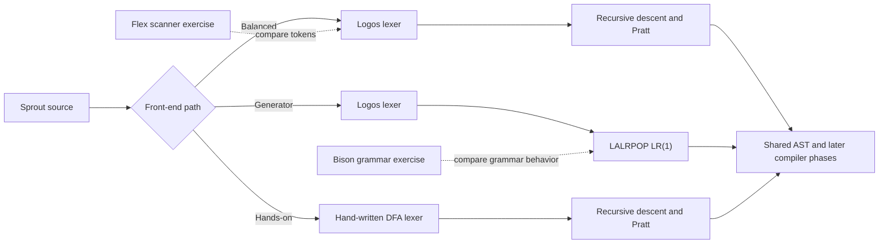
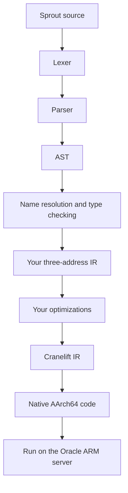
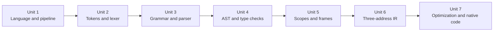

# Build Sprout on your ARM Linux server

Build one small compiler that grows with you. Sprout will have integers, booleans, variables, functions, recursion, `if`, and `while`. The finished compiler will check Sprout programs, create and optimize its own three-address code, then use Cranelift to compile that code to native ARM64 machine code.

The project follows all seven PCIT702 units. It uses Rust tools that run natively on the Oracle ARM server, while keeping Flex and Bison available for course-specific practice.

## The implementation choices

Use **stable Rust, Cargo, Logos, your choice of parser, your own three-address IR, and Cranelift**.

- Rust gives you a useful type system for AST and IR design, safe ownership for syntax trees and symbol tables, and one build tool for dependencies and tests.
- Logos turns token patterns into a deterministic lexer at compile time. Before using it, work through the DFA for identifiers and numbers by hand. This gives you the course concept and a usable generated lexer.
- For the parser, pick one route. Recursive descent with Pratt expression parsing is the clearest default. LALRPOP is the Rust-native LR(1) generator if you want generated bottom-up parsing in the main compiler.
- Your own IR keeps optimization work yours. Lower it to Cranelift only after your IR interpreter and optimizer work.
- Cranelift emits native code for AArch64. Its JIT can run compiled code directly on the server, so this project does not need to generate x86 code or install LLVM.
- Use Rust's built-in tests, `rustfmt`, and Clippy. Add `ariadne` for source-located error messages once the parser can report spans.

Flex and Bison remain useful for PCIT702. Use them for small comparison exercises if your class expects those specific tools. The main compiler does not need a second C-based front end.

References: [Rust installation and toolchains](https://rust-lang.github.io/rustup/installation/), [Logos lexer](https://docs.rs/logos/latest/logos/), [LALRPOP parser generator](https://lalrpop.github.io/lalrpop/), [Flex manual](https://westes.github.io/flex/manual/), [Bison manual](https://www.gnu.org/software/bison/manual/), [Cranelift AArch64 support](https://docs.rs/cranelift-codegen/latest/cranelift_codegen/isa/), [Cranelift JIT](https://docs.rs/cranelift-jit/latest/cranelift_jit/struct.JITModule.html), and [Ariadne diagnostics](https://docs.rs/ariadne/latest/ariadne/).

## Choose how much compiler machinery to write

Pick one path for the front end. The AST, type checker, runtime model, IR, optimizers, and native backend stay the same whichever path you choose.

| Path | Lexer | Parser | Best fit |
|---|---|---|---|
| Balanced, recommended | Logos | Hand-written recursive descent and Pratt parsing | Use a current Rust lexer generator and keep parsing decisions visible. |
| Generator route | Logos | LALRPOP | Use Rust-native generators for both front-end stages. LALRPOP generates an LR(1) parser. |
| More hands-on | Hand-written DFA lexer | Hand-written recursive descent and Pratt parser | Implement more of the front end yourself. |

Whichever path you choose, first draw and trace the DFA for a few token classes. Then compare Pratt parsing with an LR grammar on arithmetic expressions. For a course assignment that specifically requires Flex or Bison, make a small separate version of the scanner or calculator parser rather than changing Sprout's Rust build.





## The language

Keep the source language small enough to finish. Support:

- `int` and `bool`
- local declarations and assignment
- arithmetic, comparisons, and Boolean operators
- nested blocks and lexical scope
- `if` and `while`
- functions, parameters, return values, and recursion

Leave out arrays, pointers, strings, structs, classes, and modules. Add them only if you later have a concrete reason.

```text
fn factorial(n: int) -> int {
    if n <= 1 {
        return 1;
    }
    return n * factorial(n - 1);
}

fn main() -> int {
    let answer: int = factorial(5);
    return answer;
}
```

Running this program should report `120`, the value returned by Sprout's `main`. Returning a value keeps the first native backend free of I/O and runtime-linking work.

## Phase 0: set up on the server

Run the compiler on the Oracle ARM Linux server itself. Build natively for its AArch64 CPU.

1. Check the machine architecture with `uname -m`. It should report `aarch64` or `arm64`.
2. Install the stable Rust toolchain with `rustup`.
3. Add the Rust components `rustfmt` and `clippy`.
4. Create the project with `cargo new sprout`.
5. Add a command that prints usage information, then confirm `cargo run -- --help` works.
6. Commit `Cargo.lock` so the compiler uses a repeatable set of dependency versions.

Use `cargo fmt --check`, `cargo clippy --all-targets -- -D warnings`, and `cargo test` as the project grows. Add compatible Cranelift crates in Unit 7 and commit the resolved versions in `Cargo.lock`.

**Ready to start:** `cargo run -- --help` works, and `cargo test` passes on the server.

## How each unit adds one compiler stage



## Unit 1: define the compiler's job

Before coding, explain what each phase receives and produces: source text, tokens, syntax tree, resolved and typed program, IR, optimized IR, and machine code. Decide language rules for operator precedence, integer division, variable scope, and function returns.

Write two example programs and three invalid ones. Include an undeclared variable, a type error, and malformed syntax. Draw which phase reports each error.

**Deliverables:** `docs/language.md` and `docs/pipeline.md`.

**Move on when:** you can trace `2 + 3 * 4` through the compiler and explain why its syntax tree groups multiplication first.

## Unit 2: recognize tokens

Before writing code, draw DFA states for identifiers, integer literals, whitespace, and the overlapping operators `=` and `==`. Trace examples through the states and mark accepting states.

Use Logos in `src/lexer.rs` to recognize identifiers, integer literals, keywords, operators, punctuation, and comments. Attach byte spans to tokens. Keep a token-dump command so you can see exactly what the parser receives.

Check keyword prefixes such as `if` and `ifx`, multi-character operators such as `<=`, malformed numbers, and invalid characters. If your course requires Flex, write a small `.l` file for the same token set and compare its output with Sprout's.

**Deliverable:** a generated lexer that prints token kind, lexeme, and source span.

**Move on when:** you can trace a token through the hand-drawn DFA, explain longest match and keyword recognition, and account for Logos' output.

## Unit 3: parse programs

Choose your parser before starting this unit. The recommended route uses `src/parser.rs`, with recursive descent for declarations, blocks, statements, and functions, and Pratt parsing for expressions. The generated route uses LALRPOP and a `.lalrpop` grammar. Return an AST with source spans instead of evaluating while parsing.

Start with arithmetic expressions and `return`. Add variables, blocks, function declarations, calls, conditionals, and loops one construct at a time. Report syntax errors at the token span. Add recovery after the parser handles valid programs correctly.

If you chose the hand-written parser, express an arithmetic grammar in LALRPOP or Bison as a comparison. If you chose LALRPOP, hand-parse the same expressions with Pratt binding powers. Keep comparison code small.

**Deliverable:** `sprout parse example.sp` prints an AST, and malformed source gets a located syntax error. For LALRPOP, retain its grammar report or conflict output with the exercise.

**Move on when:** you can hand-parse a function with a loop, show the corresponding AST, and explain how your chosen parser handles precedence.

## Unit 4: build the AST and check meaning

Give the AST explicit variants for expressions, statements, and functions. Add a name-resolution pass that assigns each variable and function a stable symbol ID. Add a type-checking pass for `int`, `bool`, operators, calls, and returns.

Use synthesized information for expression types and inherited context for the current scope or expected return type. Keep parser actions limited to constructing syntax. Print errors with `ariadne` and the source spans already attached to AST nodes.

**Deliverable:** valid source prints a typed AST; bad names, type mismatches, and invalid returns produce clear diagnostics.

**Move on when:** you can point to one synthesized result and one inherited context in the type checker, and explain why a resolved symbol ID is safer than looking variables up by text in later passes.

## Unit 5: represent scopes and runtime storage

Implement a symbol table with nested scopes. Resolve shadowed names before runtime. Then write an AST interpreter with an explicit stack of function frames. Give each frame slots for parameters and local variables.

Draw the activation tree for `factorial(5)` and inspect the frames created by two recursive calls. Compare lexical scope lookup with the lifetime of a function's activation record.

**Deliverable:** the interpreter runs variables, nested blocks, conditionals, loops, and recursive functions. It reports `120` for the example.

**Move on when:** you can trace a call from argument evaluation to frame creation to return, and show which symbol ID each variable reference uses.

## Unit 6: lower the AST to three-address code

Define one canonical IR in `src/ir.rs`. Include constants, copies, arithmetic, comparisons, calls, labels, conditional branches, and returns. Lower the typed AST into this IR. Add an IR printer and an IR interpreter.

Print the same IR as quadruples and triples for one example. Keep one internal representation and make the other form a display choice. This lets you compare the course structures without maintaining duplicate IR models.

Compare results from the AST interpreter and IR interpreter on every example. Keep each mismatch as a failing regression case.

**Deliverable:** Sprout emits readable three-address code and the IR interpreter runs it.

**Move on when:** you can trace a loop through basic control-flow labels and explain how a source function call appears in IR.

## Unit 7: optimize and compile to ARM64

Build a control-flow graph from the IR. Split code into basic blocks. Add passes in this order:

1. Constant folding and copy propagation.
2. Local common-subexpression elimination and dead-code elimination.
3. A few peephole rules, such as removing a jump to the next instruction.
4. One loop optimization, starting with loop-invariant code motion. Study induction-variable elimination, unrolling, and jamming as separate experiments.

After the IR optimizations work, choose an endpoint. The course-scale version ends with optimized IR and an IR interpreter. For native ARM64 output, add Cranelift. Lower each IR function into Cranelift IR and use its JIT on the server. Compare the result with both interpreters. Dump Cranelift IR and generated machine code for small examples.

For register allocation, hand-allocate registers for one short basic block, then inspect Cranelift's generated AArch64 code. The project uses Cranelift's allocator for native execution. You still do a small allocation exercise so the course concept is visible.

**Course-scale deliverable:** `sprout run example.sp` runs optimized IR and `sprout dump-ir example.sp` shows your IR before and after optimization.

**Native-code extension:** `sprout run --native example.sp` compiles and runs the program on the server's ARM64 CPU.

**Finish the course-scale version when:** the AST interpreter and IR interpreter agree on the example programs, and you can show one optimization changing the IR without changing the result.

**Finish the native extension when:** the AST interpreter, IR interpreter, and Cranelift output agree. You can explain which target-specific work Cranelift performs.

## Keep the learning visible

Keep one small input for each language feature and one invalid input for each compiler phase. Run those through every execution path as it is added. Print tokens, AST, resolved AST, IR, optimized IR, and Cranelift IR so a mismatch has a visible location.

Add one feature at a time. A function call first appears in the grammar, then gets a symbol ID, runtime behavior, IR form, and native code. That sequence makes it easier to connect each unit to a working compiler.

## Where Flex and Bison fit

Use Flex and Bison if the course specifically requires them. Keep the exercise to a calculator or token-dump program. If you want a Rust-native LR parser in the main project, choose LALRPOP. If you want the parser mechanics in code you own, choose recursive descent and Pratt parsing.
